# W9 Evidence Pack — GitOps, Observability, Canary

This document is the submission checklist for the W9 "Ship Smartly" project. It records what was built, the commands used to prove it, what each result means, and the screenshots to capture.

## Project Scope

The project demonstrates a GitOps-managed Kubernetes delivery pipeline with:

- ArgoCD app-of-apps managing all platform/app components from Git.
- kube-prometheus-stack for Prometheus, Grafana, AlertManager, ServiceMonitor, and PrometheusRule support.
- Argo Rollouts for progressive delivery using a `Rollout` instead of a normal `Deployment`.
- A Flask API exposing `/metrics`, `/healthz`, and `/` with injectable failures using `ERROR_RATE`.
- An SLO recording rule and alert that fires when API success rate drops below 95%.
- An AnalysisTemplate that automatically aborts bad canaries based on Prometheus metrics.
- Git rollback using `git revert`, not `kubectl rollout undo`.

## Screenshot Index

Use this table while collecting evidence. Save screenshots under a local `screenshots/` folder.

| ID | Screenshot | What To Capture | Why It Matters |
|---|---|---|---|
| 01 | `screenshots/01-argocd-apps.png` | ArgoCD Applications page showing `root`, `api`, `web`, `kube-prometheus-stack`, `argo-rollouts`, `expense-tracker` as Synced/Healthy | Proves app-of-apps GitOps deployment |
| 02 | `screenshots/02-kubectl-apps.png` | Terminal output of `kubectl get app -n argocd` | CLI proof of ArgoCD sync/health |
| 03 | `screenshots/03-platform-pods.png` | Terminal output of monitoring and argo-rollouts pods Running | Proves platform components are live |
| 04 | `screenshots/04-api-rollout-healthy.png` | `kubectl argo rollouts get rollout api -n demo` showing Healthy | Proves API is managed by Argo Rollouts |
| 05 | `screenshots/05-prometheus-targets.png` | Prometheus Targets page showing API target UP | Proves Prometheus is scraping the API |
| 06 | `screenshots/06-prometheus-query.png` | Prometheus query for `flask_http_request_total{namespace="demo"}` | Proves Flask metrics are collected |
| 07 | `screenshots/07-slo-rule.png` | Prometheus rules/alerts page showing `APISuccessRateLow` | Proves SLO alert rule is loaded |
| 08 | `screenshots/08-alertmanager.png` | AlertManager UI showing `APISuccessRateLow` firing | Proves alert reached AlertManager |
| 09 | `screenshots/09-email-alert.png` | Email inbox showing `APISuccessRateLow` notification | Proves email routing works |
| 10 | `screenshots/10-canary-running.png` | Rollout paused/running at 25% with AnalysisRun running | Proves canary started |
| 11 | `screenshots/11-canary-aborted.png` | Rollout degraded/aborted after failed AnalysisRun | Proves automatic abort works |
| 12 | `screenshots/12-git-revert.png` | Git log showing revert commit and ArgoCD back to Synced | Proves rollback through Git |
| 13 | `screenshots/13-grafana-dashboard.png` | Grafana dashboard with API request rate/success rate/latency | Optional visual proof of observability |
| 14 | `screenshots/14-expense-tracker.png` | Expense-Tracker UI reachable via NodePort | Optional proof of 2-repo GitOps deployment |
| 15 | `screenshots/15-teardown.png` | Terminal showing `minikube delete -p w9` completed and no `w9` profile running | Proves local project cleanup was completed |

Create the folder before collecting images:

```bash
mkdir -p screenshots
```

Use the exact filenames above. The image placeholders below will render automatically once the files exist.

## Current Important Files

| File | Purpose |
|---|---|
| `argocd/root.yaml` | Root app-of-apps Application. Watches `argocd/apps/`. |
| `argocd/apps/kube-prometheus-stack.yaml` | Installs Prometheus, Grafana, AlertManager through Helm. |
| `argocd/apps/argo-rollouts.yaml` | Installs Argo Rollouts controller through Helm. |
| `argocd/apps/api.yaml` | ArgoCD Application for the Flask API manifests in `k8s-api/`. |
| `k8s-api/api.yaml` | Argo Rollout + Service for the API. |
| `k8s-api/servicemonitor.yaml` | Tells Prometheus to scrape `/metrics` from the API service. |
| `k8s-api/analysis-template.yaml` | Queries Prometheus during canary and auto-aborts bad versions. |
| `k8s-api/slo-alert.yaml` | Defines SLO recording rule and email alert. |
| `app/app.py` | Flask API with Prometheus metrics and `ERROR_RATE` failure injection. |

## Baseline Health Evidence

Run these commands when the cluster is in the clean state.

```bash
kubectl get nodes
kubectl get app -n argocd
kubectl get pods -A
kubectl argo rollouts get rollout api -n demo
```

Expected result:

- Node `w9` is `Ready`.
- ArgoCD apps are `Synced` and `Healthy`.
- Platform pods in `argocd`, `monitoring`, and `argo-rollouts` are `Running`.
- API rollout is `Healthy`, with 4 ready replicas.

Screenshots:

- `screenshots/02-kubectl-apps.png`
- `screenshots/03-platform-pods.png`
- `screenshots/04-api-rollout-healthy.png`

Take these screenshots:

1. Terminal showing `kubectl get app -n argocd` with all apps `Synced` and `Healthy`.

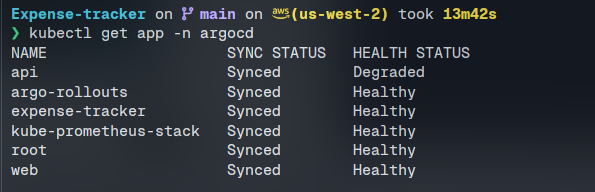

2. Terminal showing `kubectl get pods -A` with `argocd`, `monitoring`, `argo-rollouts`, `demo`, and `expense-tracker` pods running.

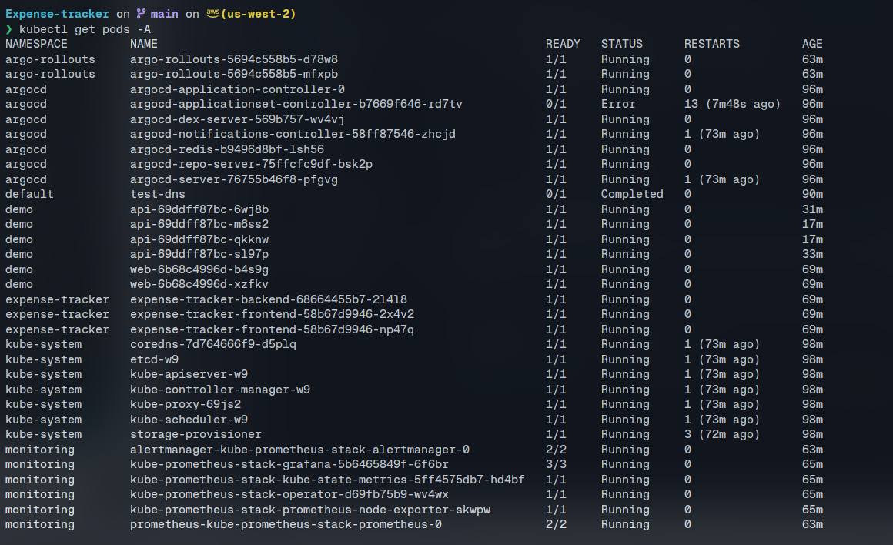

3. Terminal showing `kubectl argo rollouts get rollout api -n demo` with status `Healthy`.

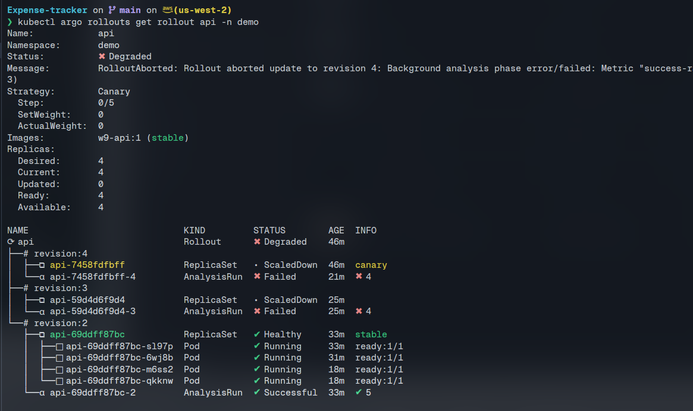

## Access URLs

Get current service ports:

```bash
minikube ip -p w9
kubectl get svc -n monitoring kube-prometheus-stack-prometheus
kubectl get svc -n monitoring kube-prometheus-stack-alertmanager
kubectl get svc -n demo api
kubectl get svc -n expense-tracker expense-tracker-frontend
```

Typical URLs:

```bash
echo "Prometheus:      http://$(minikube ip -p w9):30090"
echo "AlertManager:    http://$(minikube ip -p w9):30903"
echo "API:             http://$(minikube ip -p w9):<api-nodeport>"
echo "ExpenseTracker:  http://$(minikube ip -p w9):<frontend-nodeport>"
```

Port-forward UIs that are ClusterIP:

```bash
kubectl port-forward -n argocd svc/argocd-server 8080:443
kubectl port-forward -n monitoring svc/kube-prometheus-stack-grafana 3001:80
```

Credentials:

```bash
kubectl -n argocd get secret argocd-initial-admin-secret -o jsonpath='{.data.password}' | base64 -d; echo
```

Grafana default login:

```text
admin / prom-operator
```

Screenshots:

- `screenshots/01-argocd-apps.png`
- `screenshots/13-grafana-dashboard.png`

Take these screenshots:

1. Browser at ArgoCD UI showing the Applications grid/list. Include `root`, `api`, `web`, `kube-prometheus-stack`, `argo-rollouts`, and `expense-tracker`, all `Synced` / `Healthy`.

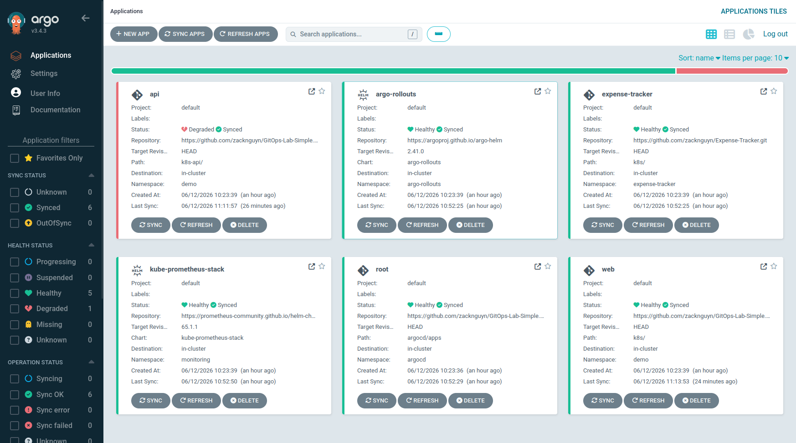

2. Browser at Grafana showing the Flask/API dashboard or any dashboard with API request/success metrics.

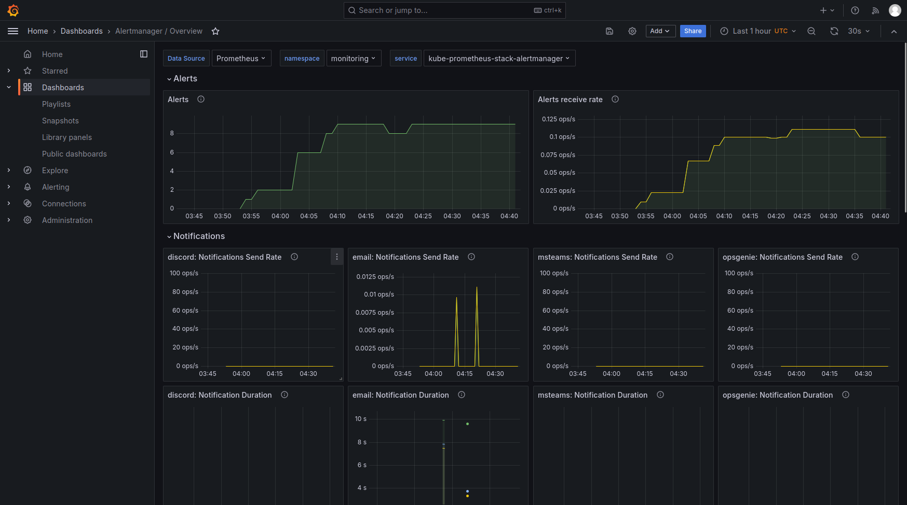

## GitOps Evidence

Show root and child Applications:

```bash
kubectl get app -n argocd
kubectl get app -n argocd root -o yaml | grep -A8 "source:"
```

Explanation:

- `root` watches `argocd/apps/`.
- Adding a new Application file to `argocd/apps/` and pushing to Git creates/syncs the child app automatically.
- `selfHeal: true` means manual cluster drift is corrected back to Git.
- `prune: true` means resources removed from Git are removed from the cluster.

Screenshot:

- `screenshots/01-argocd-apps.png`

Take this screenshot:

1. ArgoCD UI with `root` and child apps visible. This is the cleanest proof of the app-of-apps pattern.

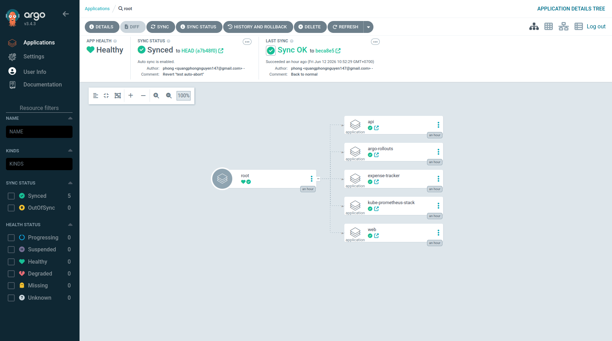

## Observability Evidence

Prometheus discovers the API through `ServiceMonitor`:

```bash
kubectl get servicemonitor -A
kubectl get servicemonitor -n monitoring api -o yaml
```

Verify the API target is scraped:

```bash
curl -s "http://$(minikube ip -p w9):30090/api/v1/targets" | python3 -m json.tool
```

Verify Flask metrics exist:

```bash
curl -s "http://$(minikube ip -p w9):30090/api/v1/query?query=flask_http_request_total" | python3 -m json.tool
```

Prometheus UI queries to capture:

```promql
flask_http_request_total{namespace="demo"}
rate(flask_http_request_total{namespace="demo"}[2m])
slo:success_rate:5m
```

Explanation:

- `prometheus_flask_exporter` exposes request counters at `/metrics`.
- `ServiceMonitor` selects the API service by label `app: api` and scrapes port `http` at `/metrics` every 15 seconds.
- `serviceMonitorSelectorNilUsesHelmValues: false` allows Prometheus to discover ServiceMonitors beyond Helm's default labels.

Screenshots:

- `screenshots/05-prometheus-targets.png`
- `screenshots/06-prometheus-query.png`

Take these screenshots:

1. Prometheus `Status -> Targets` page filtered/searching for `api`. Capture the API target in `UP` state.

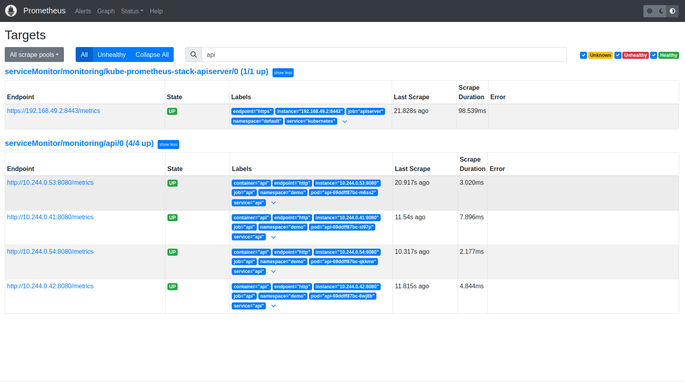

2. Prometheus Graph page showing query `flask_http_request_total{namespace="demo"}` returning API metrics.

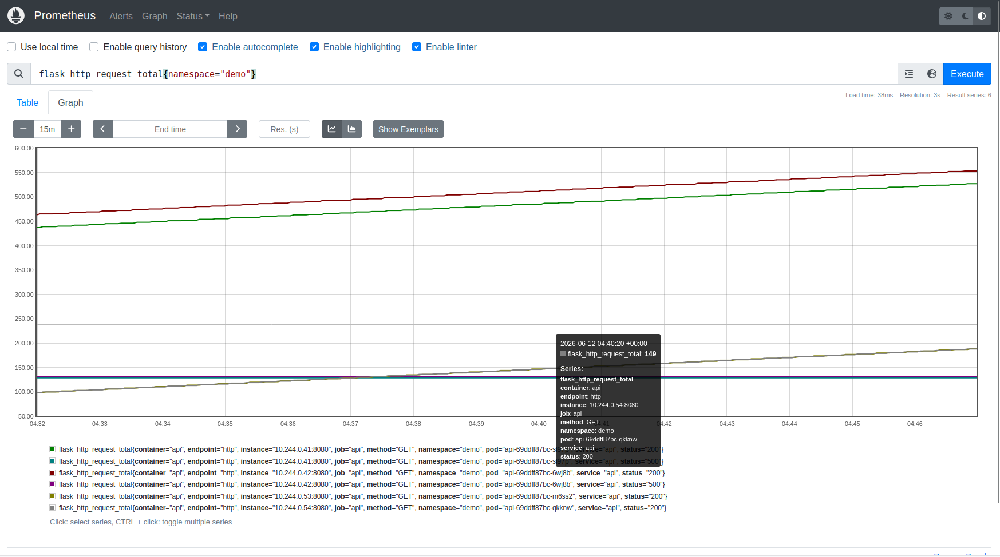

## SLO And Alert Evidence

Show the PrometheusRule:

```bash
kubectl get prometheusrule -n monitoring api-slo -o yaml
```

Check that Prometheus loaded the rule:

```bash
curl -s "http://$(minikube ip -p w9):30090/api/v1/rules" | python3 -m json.tool
```

Check current SLO value:

```bash
curl -s "http://$(minikube ip -p w9):30090/api/v1/query?query=slo:success_rate:5m" | python3 -m json.tool
```

Important PromQL:

```promql
1 - ((sum(rate(flask_http_request_total{status=~"5..",namespace="demo"}[5m])) or vector(0))
     / (sum(rate(flask_http_request_total{namespace="demo"}[5m])) or vector(0)))
```

Explanation:

- SLI: API success rate over 5 minutes.
- SLO threshold: success rate must stay at or above 95%.
- Alert: `APISuccessRateLow` fires when `slo:success_rate:5m < 0.95` for 2 minutes.
- `or vector(0)` prevents Prometheus from returning an empty vector when there are no 5xx series yet.
- The `release: kube-prometheus-stack` label is required so Prometheus discovers the rule.

Screenshot:

- `screenshots/07-slo-rule.png`

Take this screenshot:

1. Prometheus `Alerts` or `Rules` page showing `APISuccessRateLow` and/or the `api-slo` rule group. If the alert is inactive in clean state, that is fine; the evidence here is that the rule exists.

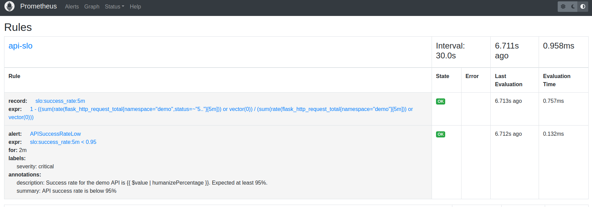

## Email Alert Evidence

Confirm AlertManager configuration is present. Do not screenshot or publish the real app password.

```bash
kubectl get secret -n monitoring alertmanager-kube-prometheus-stack-alertmanager -o jsonpath='{.data.alertmanager\.yaml}' | base64 -d
```

Expected configuration, with password redacted:

```yaml
global:
  smtp_smarthost: smtp.gmail.com:587
  smtp_from: <your-email>
  smtp_auth_username: <your-email>
  smtp_auth_password: <redacted>
route:
  routes:
    - matchers: ["alertname = APISuccessRateLow"]
      receiver: email-alerts
receivers:
  - name: email-alerts
    email_configs:
      - to: <your-email>
        send_resolved: true
```

Check AlertManager alerts:

```bash
curl -s "http://$(minikube ip -p w9):30903/api/v2/alerts" | python3 -m json.tool
```

Check logs if email is not received:

```bash
kubectl logs -n monitoring alertmanager-kube-prometheus-stack-alertmanager-0 --tail 100 | grep -iE "smtp|email|error|fail|auth"
```

Screenshots:

- `screenshots/08-alertmanager.png`
- `screenshots/09-email-alert.png`

Take these screenshots during the failure test:

1. AlertManager UI showing `APISuccessRateLow` in active/firing state.

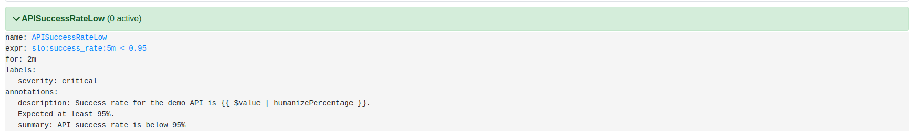

2. Gmail/inbox showing the received email for `APISuccessRateLow`. Hide or crop private data if needed, but keep alert name, firing status, and timestamp visible.

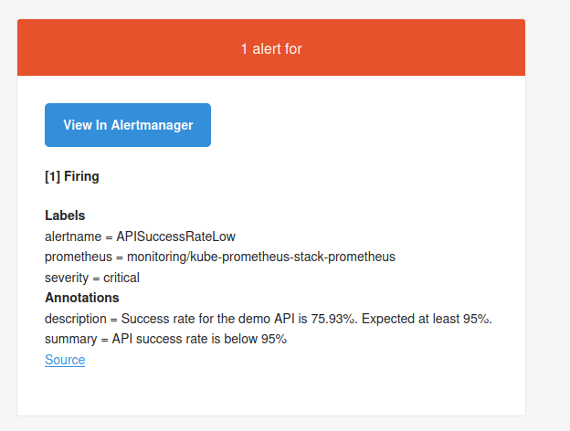

## Canary Auto-Abort Evidence

### 1. Start A Real Load Generator

The canary analysis only detects errors when traffic hits `/`. Health checks and Prometheus scrapes are not enough.

```bash
kubectl -n demo run load --image=busybox:1.36 --restart=Never -- \
  sh -c "while true; do wget -qO- http://api:8080/ >/dev/null 2>&1; sleep 0.5; done"
```

Verify traffic:

```bash
curl -s "http://$(minikube ip -p w9):30090/api/v1/query?query=rate(flask_http_request_total{namespace=\"demo\"}[1m])" | python3 -m json.tool
```

### 2. Inject A Bad Version Through Git

Edit `k8s-api/api.yaml`:

```yaml
- name: ERROR_RATE
  value: "0.3"
- name: VERSION
  value: "bad-version"
```

Commit and push:

```bash
git add k8s-api/api.yaml
git commit -m "test auto-abort"
git push
kubectl annotate app -n argocd api argocd.argoproj.io/refresh=true --overwrite
```

Watch rollout:

```bash
kubectl argo rollouts get rollout api -n demo --watch
```

Expected result:

- Rollout creates a canary ReplicaSet.
- Canary reaches 25% weight.
- AnalysisRun starts and waits 120 seconds (`initialDelay`).
- Prometheus query sees success rate below 95%.
- After more than 3 failed measurements, AnalysisRun fails.
- Rollout auto-aborts and keeps the previous stable ReplicaSet.

Screenshots:

- `screenshots/10-canary-running.png`
- `screenshots/11-canary-aborted.png`

Take these screenshots:

1. Terminal running `kubectl argo rollouts get rollout api -n demo` while the canary is at 25% and AnalysisRun is `Running`.

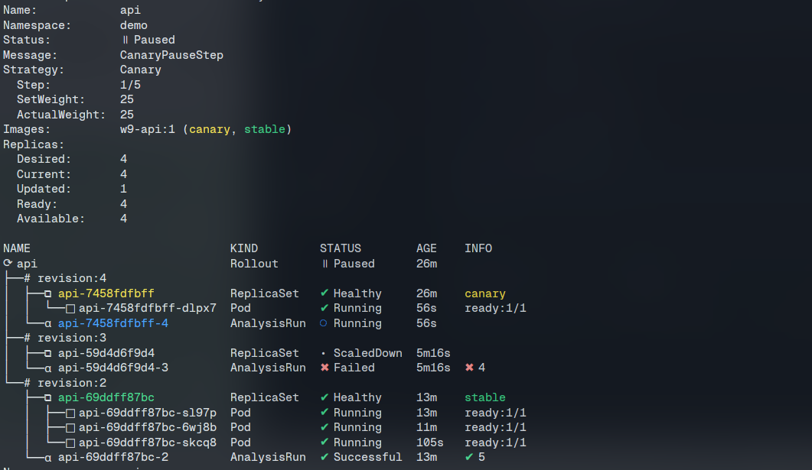

2. Terminal after the bad version fails, showing `RolloutAborted`, failed AnalysisRun, or rollout `Degraded`.

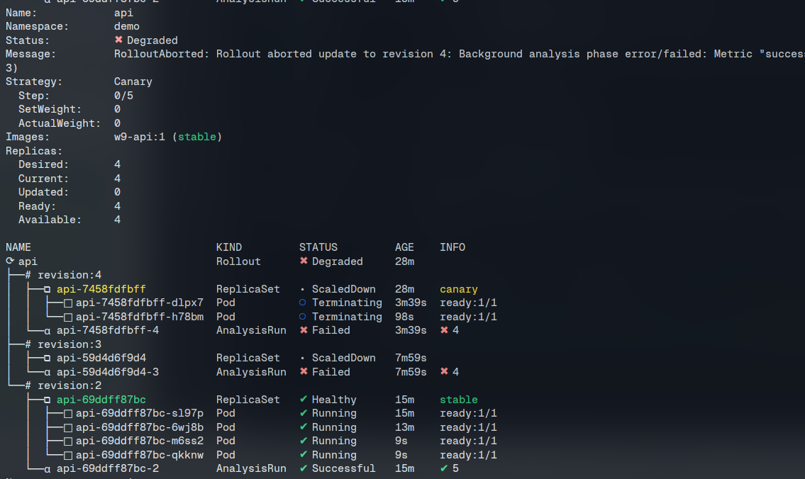

### 3. Inspect AnalysisRun

```bash
kubectl get analysisrun -n demo
kubectl describe analysisrun -n demo <analysisrun-name>
kubectl get analysisrun -n demo <analysisrun-name> -o yaml | grep -A20 "metricResults:"
```

Important AnalysisTemplate fields:

```yaml
initialDelay: 120s
interval: 30s
successCondition: "len(result) > 0 ? result[0] >= 0.95 : false"
failureLimit: 3
```

Explanation:

- Prometheus provider returns a vector, so Argo Rollouts receives a list-like `result`.
- `result[0]` is required instead of comparing `result >= 0.95`.
- `len(result) > 0` protects against empty Prometheus results.
- `initialDelay: 120s` gives the `[2m]` PromQL window enough data before the first measurement.

## Rollback Evidence With Git Revert

Rollback the bad Git change:

```bash
git log --oneline -5
git revert HEAD --no-edit
git push
kubectl annotate app -n argocd api argocd.argoproj.io/refresh=true --overwrite
kubectl argo rollouts get rollout api -n demo --watch
```

Expected result:

- A revert commit appears in Git history.
- ArgoCD syncs the reverted manifest.
- `ERROR_RATE` returns to `0`.
- Rollout returns to Healthy.

Verify current values:

```bash
grep -A1 "ERROR_RATE\|VERSION" k8s-api/api.yaml
kubectl get rollout -n demo api -o yaml | grep -A4 "ERROR_RATE\|VERSION"
```

Screenshot:

- `screenshots/12-git-revert.png`

Take this screenshot:

1. Terminal showing `git log --oneline -5` with the revert commit plus `kubectl argo rollouts get rollout api -n demo` showing the clean version returning to Healthy.

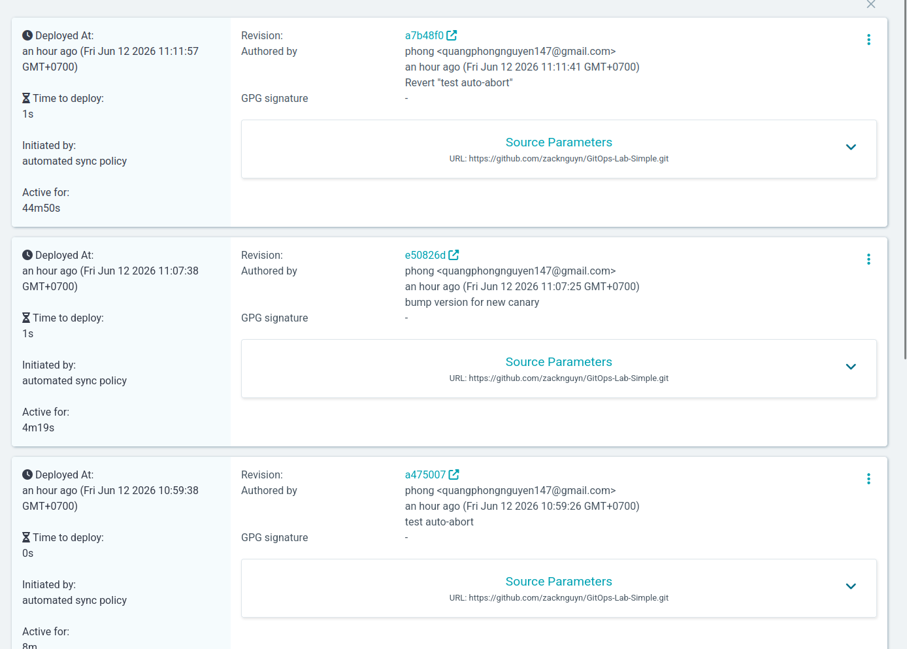

## Optional Expense-Tracker Evidence

Open the frontend NodePort URL and capture the app UI:

```bash
kubectl get svc -n expense-tracker expense-tracker-frontend
echo "http://$(minikube ip -p w9):<frontend-nodeport>"
```

Take this screenshot:

1. Browser showing the Expense-Tracker UI loaded successfully.

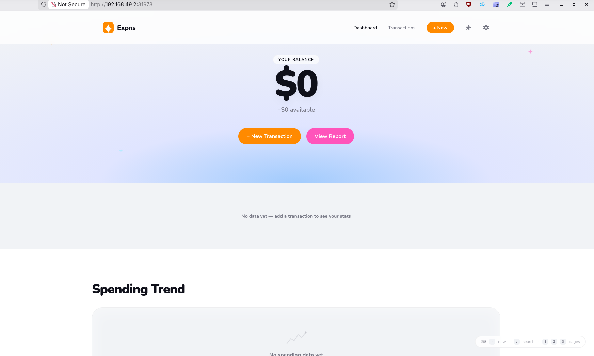

## Teardown Evidence

Use this section after all required screenshots and evidence have been collected. This removes the local minikube cluster and all Kubernetes resources created for the project.

Delete the minikube profile:

```bash
minikube delete -p w9
```

Verify the profile is gone:

```bash
minikube profile list
kubectl config get-contexts
```

Optional Docker cleanup:

```bash
docker system prune -f
```

Only run the stronger cleanup if you are sure you do not need unused local Docker images for other work:

```bash
docker system prune -a -f
```

Expected result:

- The `w9` minikube profile is deleted.
- ArgoCD, Prometheus, Grafana, AlertManager, Argo Rollouts, API, web, and Expense-Tracker resources are removed with the cluster.
- `kubectl` can no longer access the deleted `w9` cluster context unless another cluster is selected.

Screenshot:

- `screenshots/15-teardown.png`

Take this screenshot:

1. Terminal showing `minikube delete -p w9` finished successfully, followed by `minikube profile list` showing that the `w9` profile is no longer running or no longer present.


## Important Lessons Learned

| Problem | Root Cause | Fix |
|---|---|---|
| AnalysisTemplate failed with type mismatch | Prometheus provider returns a vector/list | Use `result[0]`, not `result` |
| Analysis returned empty with zero errors | No `5xx` time series exists until an error happens | Use `or vector(0)` in PromQL |
| Good canary could fail too early | Query ran before enough data existed | Add `initialDelay: 120s` |
| Bad canary promoted unexpectedly | No real traffic was hitting `/` | Run a load generator hitting `api:8080/` |
| Alert did not email | Alert never fired or Gmail app password/routing issue | Check Prometheus alert state, AlertManager API, and logs |
| Argo Rollouts chart failed on new K8s | Old chart version incompatible with K8s 1.35 | Use chart version `2.41.0` |
| Prometheus CRD sync issue | Large CRDs exceed client-side apply annotation limit | Use `ServerSideApply=true` and server-side CRD install if needed |
| Minikube did not recover cleanly after reboot | Docker bridge networking for the `w9` profile became stale and node egress failed | Recreate/reconnect the Docker network or restart Docker, then restart minikube |
| ArgoCD stuck in ImagePullBackOff after restart | The minikube node could not reach registries like `quay.io` | Verify node egress with `minikube ssh -p w9 -- curl -I https://quay.io/v2/` |
